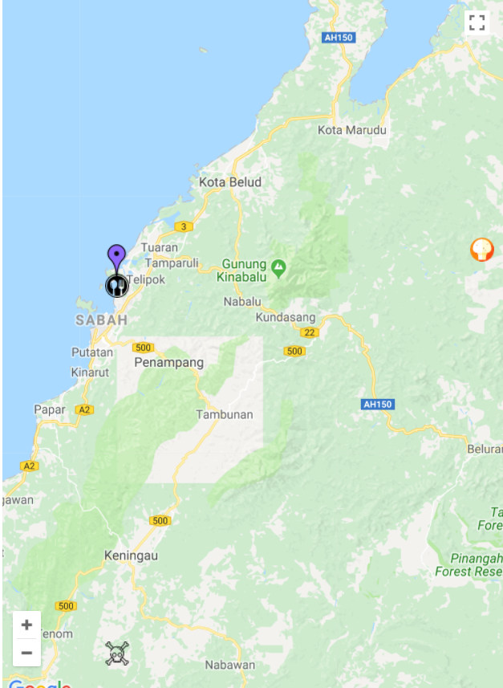
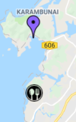
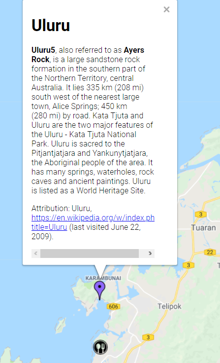
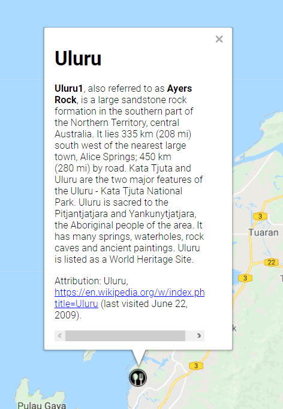
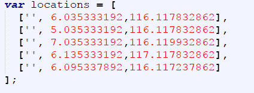
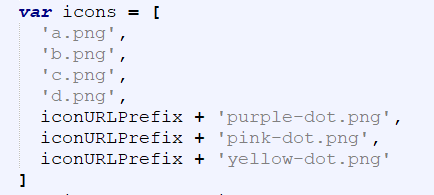

# Google-maps-with-different-marker
map with multiple marker where each marker have different pointer type and description on it

Figure 1: Show the map with multiple marker on it
 

Figure 2: Show two marker with using different image
 

Figure 3: The description on first marker
 

Figure 4: The description on second marker
 

Figure 5: predefined  location for the marker
 

Figure 6: predefined icon for the marker
 

